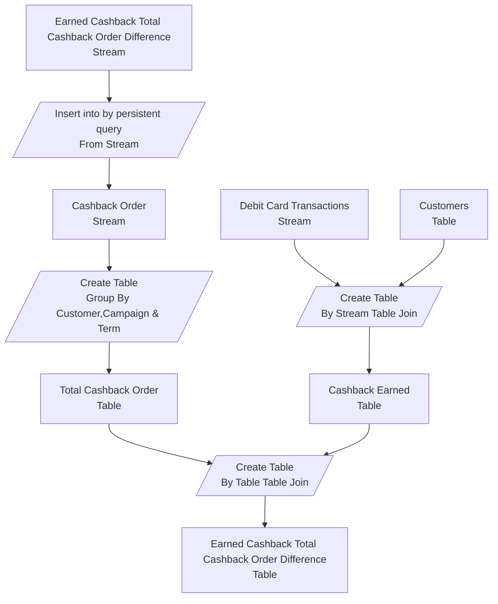

# Campaign Demo

```mermaid
graph TB;
    join1[/Create Table<br>By Stream Table Join/]
    summarize1[/Create Table<br>Group By Customer,Campaign & Term/]
    join2[/Create Table<br>By Table Table Join/]
    pquery[/Insert into by persistent query<br>From Stream/]
    txn[Debit Card Transactions<br>Stream]
    cust[Customers<br>Table]
    earned[Cashback Earned<br>Table]
    order[Cashback Order<br>Stream]
    ordertotal[Total Cashback Order<br>Table]
    txn-->join1
    cust-->join1
    join1 --> earned
    order-->summarize1-->ordertotal;
    ordertotal-->join2-->earnedorderdiff;
    earned-->join2;
    earnedorderdiffstream-->pquery-->order;
    earnedorderdiff[Earned Cashback Total Cashback Order Difference<br>Table]
    earnedorderdiffstream[Earned Cashback Total Cashback Order Difference<br>Stream]
```
